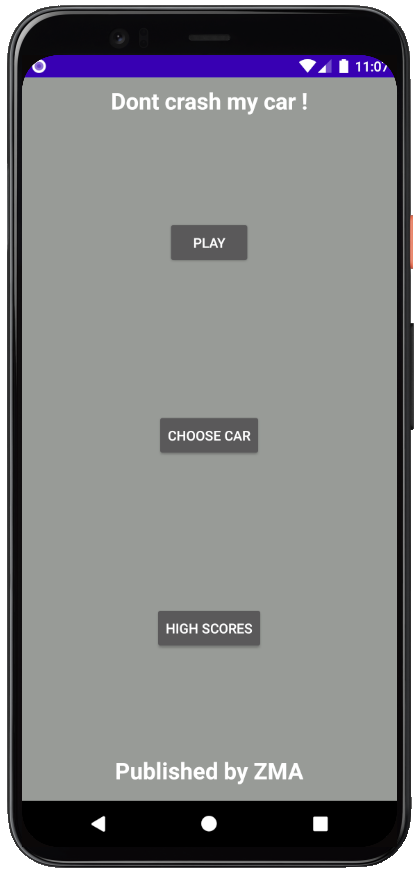
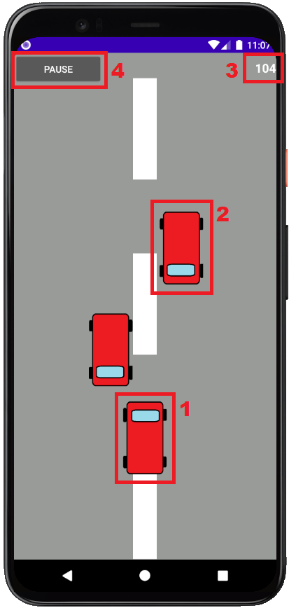
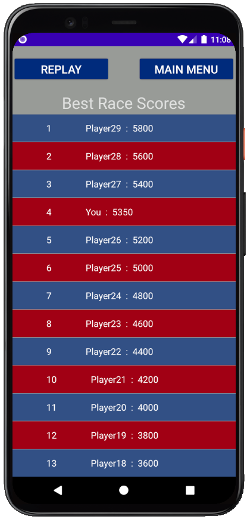

# Sumary
- [Introduction](#introduction)
- [Activities](#activities)
  - [MainActivity](#mainactivity)
  - [GameActivity](#gameactivity)
  - [ScoresActivity](#scoresactivity)
  - [CarChooserActivity](#carchooseractivity)
- [Intents](#intents)
- [Background services](#background-services)

# Introduction
*Dodge_cars* is a little runner game (like temple run or subway surfers) where the player drive a car and try to avoid all the other ones. The game only ends when the player collides with another car, so the main goal for him is to have the biggest score. This game was made by 3 people :

# Activities
**We have 4 activities that make up our app :**

### MainActivity
This activity contains only 3 buttons that permits to go to all others activities.
 

### GameActivity
This is where the game really takes place. On this activity, we have 4 main elements (see below) : 
  
1. This is the car of the player. The color of the sprite can be changed in the *CarChooserActivity*. In order to move it horizontally (it connot be moved up and down), the player must rotate the phone following the y axis (the one crossing the phone from top to bottom).
2. This car (and the other one at the left) are the cars that the player must avoid in order to continue to play. There can be up to 4 cars on the screen, and they cross the screen in a straight line from top to bottom at a random x position, at a random speed (speed that increase the more the game lasts). If the player's car collides with another car, the game ends immediately, and the player is sent to the *ScoresActivity*.
3. The score is always displayed at the top-right corner of the screen, and grows as the game lasts.
4. The pause button, which permits to... pause the game, and display a pause menu, allowing the player to resume the game or return to the main menu. 

### ScoresActivity
Here, the player can see the 30 bests scores registered in the phone (those scores are registred in a local SQLite database). 
  
From this activity, the player can decide to replay a game, or to return to the main menu.

### CarChooserActivity
From this activity, the player can choose the appearance of the car that he wants to drive.
  
He can only choose cars that he unlocked by having a sufficient high score. The maximum score reached by the player, as well as the car color that the player has chosen, is stored in the SharedPreferences of the application.

# Intents
To navigate through those activities, we need to use many intents.
* From the *MainActivity*, we have a basic (i.e empty) intent for going to the 3 others activities.
* From the *GameActivity*, we have an empty intent to go back to the MainActivity, and one for going to ScoresActivity that holds the score that the player has reach during his attempt.
* From the *ScoresActivity*, we have two empty intents : one for going to *MainActivity*, and the other one to go again to the *GameActivity*.
* From the *CarChooseActivity*, only one intent is needed, the one for going back to *MainActivity*

# Background services
We have one background service in our app : when *ScoreActivity* recieves the intent from *GameActivity* with the score, a service is started to check the score and store it in the database if needed (we only store the 30 best scores as a reminder), it will also check if the score is better than the one stored in the SharedPreferences (we store this score in order to check cars appearences that player can choose in the *CarChooseActivity*).
